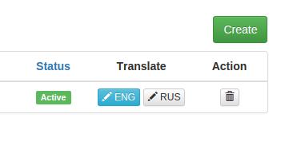

yii2-translated-behavior
===================

[](https://packagist.org/packages/lav45/yii2-translated-behavior)
[](https://packagist.org/packages/lav45/yii2-translated-behavior)
[](https://packagist.org/packages/lav45/yii2-translated-behavior)
[](https://travis-ci.org/lav45/yii2-translated-behavior)

Translated Behavior это Yii2 расширение для ActiveRecord моделей, которое поможет вам добавить возможность перевода любой сущности.

## Установка

Предпочтительный способ установить это расширение через [composer](http://getcomposer.org/download/).

Можно установить из консоли

```
$ php composer.phar require lav45/yii2-translated-behavior "~1.0"
```

или добавить

```
"lav45/yii2-translated-behavior": "~1.0"
```

в ```require``` разделе в `composer.json` файл.

## Настройка

Сначала вы должны переместить все атрибуты, которые требуются для перевода в отдельной таблице. Например, представьте, что мы
хотите сохранить перевод названия и описание от вашей post сущности. Ваши схемы таблиц следует привести к следующему виду:
```
    +--------------+        +--------------+       +-------------------+
    |     post     |        |     post     |       |     post_lang     |
    +--------------+        +--------------+       +-------------------+
    | id           |        | id           |       | post_id           |
    | title        |  --->  | created_at   |   +   | lang_id           |
    | description  |        | updated_at   |       | title             |
    | updated_at   |        +--------------+       | description       |
    | created_at   |                               +-------------------+
    +--------------+

```

После того, как вы изменили схему таблиц, теперь нам нужно определить отношение в наших `ActiveRecord` объектах и добавить поведение:

### Post
```php
use yii\db\ActiveRecord;
use lav45\translate\TranslatedTrait;
use lav45\translate\TranslatedBehavior;

/**
 * ...
 * @property PostLang[] $postLangs
 * ...
 * @property string $title
 * @property string $description
 */
class Post extends ActiveRecord
{
    use TranslatedTrait;

    public function rules()
    {
        return [
            // ...

            [['title'], 'required'],
            [['title'], 'string', 'max' => 128],

            [['description'], 'required'],
            [['description'], 'string'],
        ];
    }
    
    public function behaviors()
    {
        return [
            [
                'class' => TranslatedBehavior::className(),
                'translateRelation' => 'postLangs', // Указываем имя связи в которой будут храниться переводы
//                'languageAttribute' => 'lang_id' // Поле из таблицы post_lang в котором будет храниться язык перевода
                'translateAttributes' => [
                    'title',
                    'description',
                ]
            ]
        ];
    }

    public function attributeLabels()
    {
        return [
            // ...
            'title' => 'Title',
            'description' => 'Description',
        ];
    }

    public function getPostLangs()
    {
        return $this->hasMany(PostLang::className(), ['post_id' => 'id']);
    }
}
```

### Lang

#### migrate
```php
$this->createTable('lang', [
    'id' => Schema::TYPE_STRING . '(2) NOT NULL',
    'locale' => Schema::TYPE_STRING . '(8) NOT NULL',
    'name' => Schema::TYPE_STRING . '(32) NOT NULL',
    'status' => Schema::TYPE_INTEGER . ' NULL'
]);

$this->addPrimaryKey('lang_pk', 'lang', 'id');

$this->createIndex('lang_name_idx', 'lang', 'name', true);
$this->createIndex('lang_status_idx', 'lang', 'status');

$this->batchInsert('lang', [
    'id', 'locale', 'name', 'status'
], [
    ['en', 'en-US', 'ENG', Lang::STATUS_ACTIVE],
    ['ru', 'ru-RU', 'RUS', Lang::STATUS_ACTIVE]
]);
```

#### Lang ActiveRecord модель привожу полностью
```php
namespace common\models;

use Yii;
use yii\db\ActiveRecord;

/**
 * This is the model class for table "lang".
 *
 * @property string $id
 * @property string $locale
 * @property string $name
 * @property integer $status
 */
class Lang extends ActiveRecord
{
    const STATUS_DISABLE = 1;
    const STATUS_ACTIVE = 10;

    const PATTERN_ID = '[a-z]{2}';

    /**
     * @inheritdoc
     */
    public static function tableName()
    {
        return 'lang';
    }

    /**
     * @inheritdoc
     */
    public function rules()
    {
        return [
            [['id'], 'trim'],
            [['id'], 'required'],
            [['id'], 'string', 'min' => 2, 'max' => 2],
            [['id'], 'filter', 'filter' => 'strtolower'],
            [['id'], 'match', 'pattern' => '/^' . self::PATTERN_ID . '$/i'],
            [['id'], 'unique'],

            [['name'], 'trim'],
            [['name'], 'required'],
            [['name'], 'string', 'max' => 32],
            [['name'], 'unique'],

            [['locale'], 'trim'],
            [['locale'], 'required'],
            [['locale'], 'string', 'max' => 8],

            [['status'], 'integer'],
            [['status'], 'default', 'value' => self::STATUS_ACTIVE],
            [['status'], 'in', 'range' => array_keys($this->getStatusList())],

            [['id', 'status', 'locale'], function($attribute) {
                if ($this->isAttributeChanged($attribute, false) && $this->isSourceLanguage()) {
                    $this->addError($attribute, 'This field is not editable.');
                }
            }],
        ];
    }

    /**
     * @inheritdoc
     */
    public function attributeLabels()
    {
        return [
            'id' => 'ID',
            'locale' => 'Locale',
            'name' => 'Name',
            'status' => 'Status',
        ];
    }
    
    /**
     * @return boolean
     */
    public function isSourceLanguage()
    {
        return $this->getOldAttribute('id') == substr(Yii::$app->sourceLanguage, 0, 2);
    }

    /**
     * @return array
     */
    public function getStatusList()
    {
        return [
            static::STATUS_ACTIVE => 'Active',
            static::STATUS_DISABLE => 'Disable',
        ];
    }

    /**
     * @return array
     */
    public static function getList()
    {
        return static::find()
            ->select(['name', 'id'])
            ->orderBy('id')
            ->indexBy('id')
            ->asArray()
            ->column();
    }

    /**
     * @return array
     */
    public static function getLocaleList()
    {
        return static::find()
            ->select(['locale', 'id'])
            ->where(['status' => self::STATUS_ACTIVE])
            ->indexBy('id')
            ->asArray()
            ->column();
    }
}
```

## Использование

### Backend

backend/config/bootstrap.php
```php
Yii::$container->set('lav45\translate\TranslatedBehavior', [
    'language' => isset($_GET['lang_id']) ? $_GET['lang_id'] : null
]);
```

backend/controllers/PostController.php
```php
namespace backend\controllers;

use yii\web\Controller;
use yii\data\ActiveDataProvider;

use common\models\Post;
use common\models\Lang;

class PostController extends Controller
{
    public function actionIndex()
    {
        $dataProvider = new ActiveDataProvider([
            'query' => Post::find()
                ->with([
                    'currentTranslate', // загружаем связанные данные с текущим перевод
                    'hasTranslate' // нужна для отображения статуса была ли переведена страница
                ]),
        ]);

        return $this->render('index', [
            'dataProvider' => $dataProvider,
            'langList' => Lang::getList(),
        ]);
    }
// ...
}
```

backend/view/post/index.php
```php
    <?= GridView::widget([
        'dataProvider' => $dataProvider,
        'columns' => [
            [
                'class' => 'lav45\translate\ActionColumn',
                'languages' => $langList,
            ],
            [
                'class' => 'yii\grid\ActionColumn',
                'template' => '{delete}'
            ],
        ],
    ]);
    ?>
```
В результате после сознания новой страницы получим нескалько кнопок для редактирования контента на разный языках



Так можно получить текущий язык из модели
```php
/**
 * @var $this yii\web\View
 * @var $model common\models\Page
 */

$this->title = 'Create Post ( ' . $model->getLanguage() . ' )';
```

### Frontend

frontend/config/main.php
```php
use common\models\Lang;

return [
    'components' => [
        'urlManager' => [
            'enablePrettyUrl' => true,
            'showScriptName' => false,
            'rules' => [
                '<_lang:' . Lang::PATTERN_ID . '?>/<id:\d+>'  => 'post/view',
                '<_lang:' . Lang::PATTERN_ID . '?>'  => 'post/index',
            ],
        ],
    ],
];
```

frontend/controllers/PostController.php
```php
namespace frontend\controllers;

use yii\web\Controller;

use common\models\Lang;
use common\models\Post;

class PostController extends Controller
{
    public function behaviors()
    {
        return [
            [ // ContentNegotiator будет отпределять из URL или настроек браузера язык и устанавливать его в
              // Yii::$app->language, каторый использует класс TranslatedBehavior как язык перевода
                'class' => 'yii\filters\ContentNegotiator',
                'languages' => Lang::getLocaleList()
            ],
        ];
    }
```

## Лицензия

**yii2-translated-behavior** выпускается под BSD 3-Clause лицензией. Подробную информацию можно найти в `LICENSE.md`.